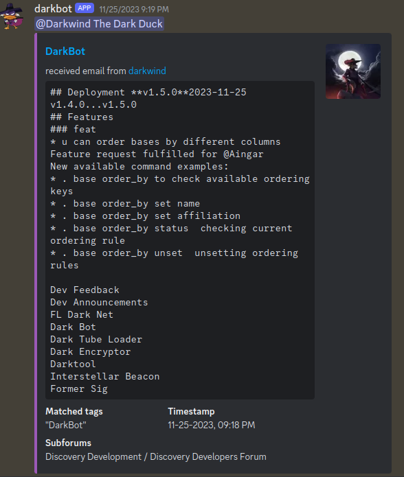

# Darkbot

  

# Getting started

- [Getting started and documentation how to use it](https://darklab8.github.io/fl-darkbot/)

### other links

- [Discovery Forum Thread and anouncements](https://discoverygc.com/forums/showthread.php?tid=188040)
- [Github of the project](https://github.com/darklab8/fl-darkbot)
- [See other Dark Tools for Freelancer here](https://darklab8.github.io/blog/pet_projects.html#DiscoveryFreelancercommunity)

# Project Description for devs (See Getting started for users)

- This project is a discord bot **Darkbot3** for open source game community [Freelancer Discovery](https://discoverygc.com/)
- It implements Discord bot to track player bases, players themselves and forum posting with notifications to Discord.
- The logic of it: User connects darkbot to some discord channel, and sets settings which space bases, player tags or space systems to track. Darkbot repeatedly updates information to discord channel
- project saves ready for deployment docker images [at docker hub](https://hub.docker.com/repository/docker/darkwind8/darkbot/general), see [settings here](https://github.com/darklab8/fl-darkbot/blob/master/tf/modules/production), which are invoking [this configuration](https://github.com/darklab8/fl-darkbot/blob/master/tf/modules/darkbot)

# Architecture

The project has 5 package parts parts:

- scrappy scraps third party REST APIs and web forum for data. Stores in in storage (memory) to other modules
- configurator is interacting with SQL database to store user settings
- listener is Discord API connected application, that accepts user commands from channel and sends to consoler, and gives from it answer
- consoler is a CLI interface to accept input from listener and render its CLI answer back
- viewer is application that in a loop gets user settings and connected channels, and rerenders to them view based on available data in scrappy and configurator settings

# Tech stack

- golang
- discordgo
- cobra-cli
- gorm (sqlite3)
- docker
- terraform (hetzner / docker cli ami image)
- terraform docker provider

# Dev commands

install taskfile.dev for dev commands

go run . --help

task test # to test
task --list-all # to list other commands

See [Taskfile.yml](<./Taskfile.yml>) for the rest of available dev commands

# Dev Configurations:

- create your own Discord app link and use it for development
by providing it through [Environment variables documentated there](./.vscode/settings.example.json)

- If you are me, then just use your dev env inviting link you already created:
    - https://discord.com/api/oauth2/authorize?client_id=1071516990348460033&permissions=8&scope=bot

- [App specific configurations](./app/settings/main.go) can be found here.
- By default Console prefix to use command is `;`. Like `; --help` for dev env.
- We use README for dev specific stuff to documetn
- We use static site generator via mkdocs to document stuff for end users

- The project depends on having two private URL from Discovery API for its running. Provided by Alex.
  - Development is possible without them as with env var you can mock data receved from them.

# Dev standards

- Code architecture should be unit testable, even if tests will not be covering everything (Intercepting input from Discord to Cobra CLI and rendering output from it to Discord was made to minimize Discord code footprint to minimum for this reason)
  - Integration (kind of unit testing) is available for majority of code logic by just triggering Cobra CLI commands.
- following different OOP principles, like having minimum exposed interfaces to rest of a code
- following semantic versioning and generating changelogs with the help of [autogit](https://github.com/darklab8/autogit)
- Keep amount of dependencies low for easier long term maintanance. (TODO Recheck which dependencies u can delete later)
  - To simplify long term maintanance, dependencies will be vendored in.

# Project status

- Finished its core development of features
- In long term maintenance mode

# Acknowledgements

- Freelancer Discovery API provided by [Alex](https://github.com/dsyalex) as a way to deliver info from Flhook to the bot
- [Pobbot](https://github.com/dr-lameos/Pobbot) originally made by dr.lameos sparkled this project
- Forum tracking is inspired by Biqqles project [forumlancer](https://github.com/biqqles/forumlancer)
